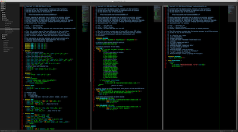

LFE (Lisp Flavored Erlang) in Sublime Text 2
============================================

This `Sublime Text 2`_ package provides support for syntax highlighting of
`LFE`_.

Installation
------------

Just do the following:

.. code:: bash

   $ mkdir -p ~/lab/SublimeText
   $ cd ~/lab/SublimeText
   $ git clone https://github.com/lfe/st2-lfe.git
   $ cd ~/Library/Application\ Support/Sublime\ Text\ 2/Packages/
   $ ln -s ~/lab/st2-lfe/LFE .

Configuration
-------------

If you would like to dim the parenthesis down visually, you can use the
`VimBlackboard`_ Sublime Text 2 package. This will give you a look such as this:

If you'd just like to continue using your own theme, you can update it to use
dimmed parens with the following snippet:

.. code:: xml

    <dict>
        <key>name</key>
        <string>Lisp Parens</string>
        <key>scope</key>
        <string>source.parens.lisp</string>
        <key>settings</key>
        <dict>
            <key>foreground</key>
            <string>#666666</string>
        </dict>
    </dict>

.. Links
.. -----
.. _Sublime Text 2: http://www.sublimetext.com/2
.. _LFE: http://lfe.github.io/
.. _VimBlackboard: https://github.com/oubiwann/Theme-VimBlackboard
